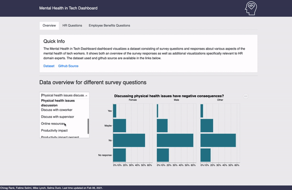

## Welcome!

Welcome! :tada:  Mirësevini! :star2:  स्वागत हे :confetti_ball:  Dobrodošli! :balloon::balloon::balloon:

Thank you for visiting the Mental Health in Tech app project repository.

-   [Mental Health in Tech Dashboard](#mental-health-in-tech-dashboard)
    -   [Relevance](#relevance)
    -   [Overview](#overview)
-   [License](#license)

Mental Health in Tech Dashboard
===============================

The Mental Health in Tech Dashboard dashboard visualizes a dataset consisting of survey questions and responses about various aspects of the mental health of tech workers. It shows both an overview of the survey responses as well as visualizations specifically relevant to HR domain experts, and allows for filtering based on the age and sex of survey respondents.

The most recent version of the dashboard is available at the following link: https://mentalhealth-in-tech.herokuapp.com/

Relevance
---------

Although HR departments implement processes and cultivate workplace
culture so as to encourage good mental health, it is often unclear
whether these policies do in fact make a difference. With our intended
dashboard HR professionals who are in charge of setting HR policy in
organizations would be able to visually explore a survey data set of
mental health attitudes from tech workers across the globe to identify
potential connections that may help with policy setting.

Overview
--------

The app provides visual insights about the survey data set which
includes countries and number of respondents in each country, number of
respondents related to a certain sex, the age range of survey
respondents, number of people in the data set who are self-employed
versus the number of people who work in a company, number of companies
that are in of the tech industry versus the ones that are not, each
shown visually in charts (bar chart, density chart, etc. depending on
the type of data). The app also contains a dropdown list that includes
survey questions. Moreover, the app has radio buttons which allow HR
professionals to filter between the respondents pertaining to a
particular sex, i.e. female, male, or other; it also has one additional
dropdown list which allows HR professionals to filter between the
companies that provide wellness program for their employees, or if the company makes it easy to apply for a
medical leave for a mental health condition, or if the company
provides care options for mental health care. These
widgets in the app will allow HR professionals to compare and contrast
the mental health condition of employees and the relation to those
variables, namely the benefits and care options an employer provides for
their employees.

Below is a GIF of our Mental Health in Tech Dashboard

License
=======

The materials about Mental Health in Tech Dashboard are licensed under
the MIT License (Copyright (c) 2021 Master of Data Science at the
University of British Columbia). If you want to re-use/re-mix the
materials used in this project, please provide attribution and link to
this repository.
